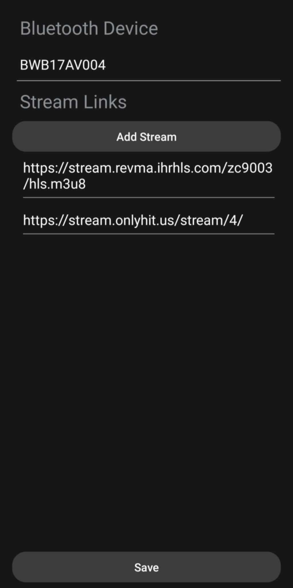
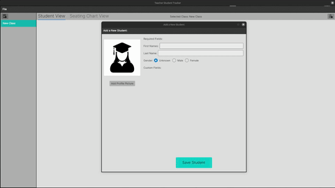

Some of my personal and school projects

# Bluetooth Radio App
App I made for myself designed to replace my car radio that automatically detects a car stereo bluetooth device and uses it to play radio streams from the internet. Stations can be customized and be controlled from buttons on the bluetooth transmitter.
To use it I do not need to touch the phone it runs on at all.

This app was written mostly in kotlin.

[Link to GitHub Repo](https://github.com/18janderson3/18janderson3.github.io/tree/main/BluetoothRadio)

# Social Media Site
This is an image sharing forum and social media site. Users can create accouts, start discussions, and post images.

It uses a Django backend for handling authentication, REST APIs, and data storage. The frontend uses react for displaying forum threads.

[Link to GitHub Repo](https://github.com/18janderson3/18janderson3.github.io/tree/main/SocialMedia)

# Student Tracker Tool
This student tracker tool was made for school teachers to use to organize their classes and make seating charts. It allows you to customize student data and room layouts.

The app was built using .Net Core and the Avalonia UI library. It features a GUI system that allows the user to create student lists with custom data and to create custom objects and resize them within a room layout. It can run on multiple operating systems and is capable of saving and loading data on the host machine.

[Link to GitHub Repo](https://github.com/18janderson3/18janderson3.github.io/tree/main/TeacherStudentTracker)

# Mock Banking App
This app simulates an online banking interface. there are pages for signing up, logging in, viewing different accounts, depositing and widrawing money, transfering money between accounts, and viewing transaction history.

It utilizes the MERN stack with React on the front end, Node.js and express on the backend, and MongoDB for storing data. It uses sessions and password hashing to handle user authentication. It uses MongoDB for storing user data including login info, account information, amounts in the accounts, and transaction history. The frontend will use REST API calls to the backend when it needs data from the database.

I was specifically resposible for setting up the frontend and backend frameworks, working on UI design, and creating unique API routes. 

[Link to GitHub Repo](https://github.com/18janderson3/18janderson3.github.io/tree/main/BankingApp)

# Speed Card Game
This is a Multiplayer game that recreates the card game called California speed. it can be played between two devices through a web browser. The game is played in realtime and then stores the Highscores in a database.

It utilizes the MERN stack with React on the front end, Node.js and express on the backend, and MongoDB for storing data. It also uses web sockets for real-time user to user communication. The game is played in real time and uses the web sockets to communicate between the backend server and the other player. The player name and high scores are then stored using REST API calls and stored in a MongoDB database. 

I was specifically responsible for creating the unique websockets and developing the game logic.

[Link to GitHub Repo](https://github.com/18janderson3/18janderson3.github.io/tree/main/Speed)

